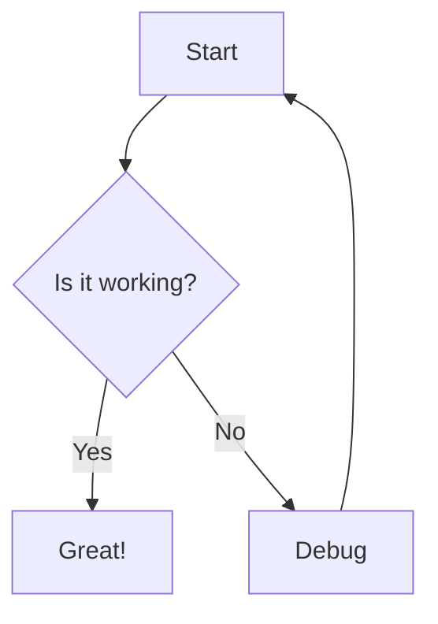

# mermaid-cli

## Overview

Mermaid CLI (mmdc) is a command-line interface for generating diagrams and flowcharts from Mermaid syntax.
It allows you to create various types of diagrams including flowcharts, sequence diagrams, class diagrams,
state diagrams, and more, all defined in simple text format.

## Installation

- **Method**: npm (global)
- **Role Path**: `ansible/roles/dev/mermaid_cli`

## Configuration

Mermaid can be configured via:

- Command-line options
- Configuration file (`mermaid.config.json` or `.mermaidrc`)
- Inline configuration in diagram files

## Usage

Mermaid CLI provides commands for rendering diagrams:

- `mmdc -i input.mmd -o output.png` - Render diagram to PNG
- `mmdc -i input.mmd -o output.svg` - Render diagram to SVG
- `mmdc -i input.mmd -o output.pdf` - Render diagram to PDF
- `mmdc -i input.mmd -o output.md` - Render diagram embedded in Markdown
- `mmdc -i input.mmd -o output.png -t dark` - Use dark theme
- `mmdc -i input.mmd -o output.png -b transparent` - Transparent background

## Variables

| Variable              | Description                                        |
| --------------------- | -------------------------------------------------- |
| `npm_install_package` | npm package to install (`@mermaid-js/mermaid-cli`) |

## Dependencies

- npm package manager
- Chromium or Puppeteer (automatically installed with package)

## Example Diagram

